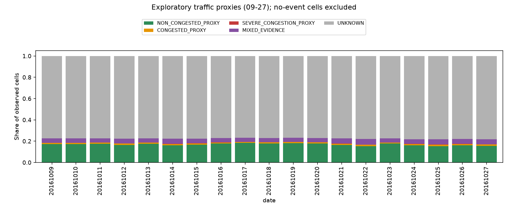

# 第一批结果：可解释、时变、有支持度的交通状态

## Material Passport

- Origin Skill: academic-research-suite / experiment-agent
- Origin Mode: descriptive analysis and validation
- Origin Date: 2026-09-27
- Verification Status: ANALYZED（不是独立交通真值验证）
- Version Label: traffic_state_batch1.1
- 执行基线：298db48；独立新增分析目录。

## 结论

**现有信号足以构造受支持的时变运行状态代理，但尚不足以把全路网可靠地
划成“畅通/拥堵/极端拥堵”，更不能据此宣称三档 AV 的真实通行能力。**

第一批已经完成可访问数据上的盘点、支持度、候选定义及描述性验证；没有调整
profile、重训 M3、读 Test31、跑派单或修改冻结结果。局部观测覆盖、组件有效掩码
和交通真值仍有缺口。这些限制是本批发现，不应被包装成“交通状态已校准”。

## 1. 数据和运行

- 09–24 拟合描述性参考，25–27 只应用，不进入 fit。
- 190,000 个已筛选订单、4,998,113 个直接观测 traversal 事件。
- 排除 351 条跨原订单日期午夜事件；实际分桶 4,997,762 条。
- 13,941 个被观察到的有向 edge，2,066,052 个有观测 half-hour cells。
- reference 可得 edge 11,724 个；达到 100 order-days、5 天支持的 4,644 个。
- 全部 19 天 event SHA 对上旧 manifest；19 天 M3 cache SHA 对上各自 manifest。
- 主运行 exit 0，70.22 秒，峰值 RSS 546.69 MiB，GPU 未使用。
- M3 checkpoint 和 Stage3 profile 执行前后 SHA 一致。

来源清单和机器可读值见 [summary.json](summary.json)、
[signal_inventory_counts.json](signal_inventory_counts.json)、
[prediction_inventory.json](prediction_inventory.json)。

## 2. 支持度比三档命名更重要

| 当前规则下状态 | Cell 数 | 占有观测 cell | 占非 UNKNOWN cell |
|---|---:|---:|---:|
| NON_CONGESTED_PROXY | 349,272 | 16.905% | 75.111% |
| CONGESTED_PROXY | 23,728 | 1.148% | 5.103% |
| SEVERE_CONGESTION_PROXY | 2,632 | 0.127% | 0.566% |
| MIXED_EVIDENCE | 89,374 | 4.326% | 19.220% |
| UNKNOWN | 1,601,046 | 77.493% | 不适用 |

非 UNKNOWN 合计 465,006（22.507%）；这还包含 MIXED_EVIDENCE，不能全称
“已三分类”。能够落入三类代理的仅 375,632 个，占有观测 cell 18.181%。

每一天 joint_order_count 的中位数都是 **1**。在当前参考、跨度、新鲜度条件不变时：

| 最低 joint 订单数 | 非 UNKNOWN cell | 占有观测 cell |
|---|---:|---:|
| 1 | 643,717 | 31.157% |
| 3（本批默认） | 465,006 | 22.507% |
| 5 | 208,299 | 10.082% |

这是覆盖敏感性，不是精度曲线；不能为了多覆盖直接选择 1。
即使不加 count 门槛，仍需 reference、跨度和新鲜度。

未知相关原因可重叠：订单不足 1,478,142；完成时刻跨度不足 1,215,759；
最新证据过旧或无 joint evidence 1,035,979；reference 支持不足 162,302。
不能把这些数量相加解释为未知总数。

还有 10,648,140 个无事件 cell（仅在研究观察 edge 并集×19天×48桶中计算）。
它们没有物化，不能从图中消失后被当作畅通。详见 [支持度与分母](support_and_schema.md)。

## 3. 时变信号存在，但尚不等于真值验证

25–27 的非 UNKNOWN 窗口中，拥堵与严重拥堵代理合计占比：

- 07 时：8.14%；08 时：7.70%。
- 12 时：3.37%；13 时：3.51%。
- 17 时：15.85%；18 时：18.20%。
- 21 时：1.99%；22 时：1.01%。

这是与晚高峰变化相容的描述性现象，不是分类准确率。各小时道路集合和支持量
不同；例如 04 时只有 12 个非 UNKNOWN 窗口，零拥堵标签不代表全城畅通。

相邻且双方均非 UNKNOWN 的窗口对为 222,460，其中 63,759（约 28.66%）状态
变化，包含 MIXED_EVIDENCE 的转换。它既可能反映真实变化，也可能包含阈值附近
波动与取样变化，不能作为交通状态转换概率直接进入模型。

[6 组时间序列示例](illustrative_temporal_cases.png)按每个 Validation 日高支持
排序选取（非随机，非代表总体）。它们保留每窗支持数与 unknown 点，不跨缺测插值。
本批未核验连续空间走廊的完整状态一致性；没有将有观测 traversal 的跳序误称相邻 link。

## 4. 道路等级影响可识别性

25–27 有观测窗口中，非 UNKNOWN 占比为：

| 道路等级 | 非 UNKNOWN / 有观测 cell |
|---|---:|
| trunk | 47.72% |
| primary | 30.96% |
| secondary | 21.01% |
| tertiary | 5.55% |
| residential | 0.30% |

这首先是支持度差异，不能推出住宅道路更畅通/更难通行。
现有上游审计已指出稀有原始情境的 Stage0 条件通过率 54.66%，常见情境 61.66%，
而动态监督还发生进一步流失（`stage2/docs/v5_2/upstream_sampling_audit/`）。
本批复用的是通过筛选的订单，**没有估计不合格订单中严重拥堵的漏失率**。

## 5. 为什么要保留证据不一致

89,374 个 MIXED_EVIDENCE 中：

- 79,629 个是相对 pace>=1.5，但低速占比<0.5；
- 9,745 个是低速占比>=0.5，但相对 pace<1.5。

前者可能是高基准速度道路上的相对减速，绝对速度尚未降到现有 crawl 阈值；
后者可能是常态较慢道路、信号控制或局部采样。上述只是解释候选，未证明原因。

因此“相对拥堵”和“绝对低速”应先保留为二维证据。不能把 19.22% 的支持窗口
丢弃后声称三档划分非常清晰，也不应把 speed limit 的角色直接删去。

## 6. 测量缺口和下一步边界

Stage1 原 bucket 访问被拒绝；既有 history 表缺少直接 interval 数、观测时长/
距离覆盖、加速度 pair_count 和窗口原始开始时刻。现有代码可以追溯公式，但本轮
无法从这些 history 字段复核完整测量质量。CV 非空 99.775% 不是 target-valid
99.775%，所以本批不冻结“不稳定交通”二元标签。

下一批建议先完成以下窄任务，而不是立即替换 profile：

1. 恢复原 Stage1 分区的只读访问，或找到已保存的包含原有效 mask/coverage 的
   派生表；不需要重跑 Stage0/1。补齐 partial-window 与组件测量支持核对。
2. 做新状态与现有 E/Q/C 的交叉解释，查看是否重复计罚（第 5 步）。
3. 然后明确 C/M/A 对 relative slowdown、低速暴露、未知证据的假设性适配规则
   （第 6 步）；不直接把“严重拥堵 proxy”解释成物理不可通行。

本轮在第一批停止，没有执行以上后续任务。

## 7. 最小 QA 与统计解释

- 3 个单元测试通过：未知处理/候选公式、方向隔离/订单等权/时间边界、日期范围。
- 19 日日表主键唯一，joint_order_count<=order_count，重算 classification 与落盘
  state 逐行完全相同，road_class_conflict_cells=0。
- 图片经过本地可视检查；Validation cache 清单修正到真实 m3_validation 目录，
  此修正不改变状态数据、参考或阈值。
- compileall 与 diff check 通过。测试第一次有 pytest cache 写权限 warning，
  非测试失败；最终禁用 cacheprovider 核验。
- 本批没有 p 值、CI 或因果效应估计；没有独立人工交通真值。

研究技能的 11 类统计误读检查：

| 项目 | 本批处理 |
|---|---|
| Simpson | 输出道路等级/小时/日期切片；不把聚合占比解释成分层因果 |
| Ecological | cell 描述不外推个体 AV 能力 |
| Berkson | 已筛选样本偏差明确保留 |
| Collider | 没有控制变量回归；不从通过筛选推因果 |
| Base rate | 有事件/无事件/未知/混合证据分母全部保留 |
| Regression to mean | 高支持例图不用于前后改善声明 |
| Survivorship | 承认 Stage0 选择和标签流失 |
| Look-elsewhere | 输出所有预定切片，不挑显著结果 |
| Forking paths | 执行前配置公开，探索性而非确认性 |
| Correlation/causation | 高峰相容性不等于已识别拥堵原因 |
| Reverse causality | 无因果方向或决策优越性结论 |

检查范围 11/11；这不等于消除了所有统计偏差。
