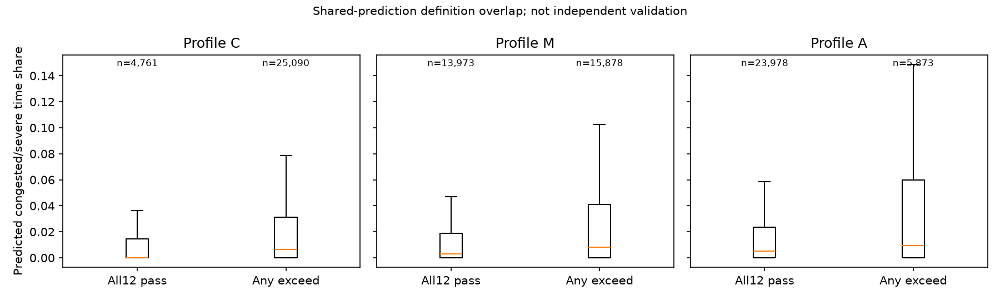

# 第二批结果：交通状态并非现有动态 profile 的简单改名

## Material Passport

- Origin Skill: academic-research-suite / experiment-agent
- Mode: authorized descriptive analysis and interpretation
- Date: 2026-09-27
- Verification Status: ANALYZED（数据重构核对通过，不等于交通/AV 真值验证）
- Baseline: 4062ea4

## 结论

**测量支持已从可读的原输入中恢复；新交通状态与 crawl/stop 有重叠，但无法
替代整套 E/Q/C。C/M/A 可增加嵌套目标交通环境的假设，当前最合适先作解释层。**

本批完成支持恢复、第 5 步交叉解释及第 6 步适配草案。没有修改现有 profile、
模型或第一批阈值，没有重新运行 Stage0/1、M3 推断、Test31 或派单。

## 1. 上批访问缺口如何关闭

Stage1 output_v3 bucket 仍拒绝访问，本轮没有改变 ACL。
但原 `stage1/input_v1` 的直接区间和物理 traversal 可读，因此可以按 bucket
恢复 count/time/distance/window 支持；组件有效性复用 SHA 对账通过的 Stage2
逐日路线表 target masks。不是重新生产或修改 Stage1 标签。

结果覆盖 09–27 的：

- 16,114,979 个 direct_observed、label_valid GPS intervals；
- 4,998,113 个直接观测 traversal，与历史事件一一对账；
- 重新聚合的观测结束时间与历史 availability_timestamp 最大误差 **0 秒**；
- 对历史 pace 非空行，重构时间/距离与历史 pace 最大误差 **0 s/m**；
- 直接测量距离超过 traversal 分配距离的记录 **0**。

原 input_v1 无逐文件冻结 SHA 的完整链在本批未补造：本次记录实际读入文件 SHA、
核原 bucket 行数/状态，并通过与 hash-bound history 值逐条一致核对来验证重构。
19 个 Stage2 路线文件及 3 个 M3 Validation cache 则与现有 manifest SHA 对账。

### 组件非空 ≠ 有效

| 信号 | 有效 traversal 数 | 占直接观测 traversal | 非空但无效 |
|---|---:|---:|---:|
| crawl | 4,998,113 | 100% | 0 |
| stop | 4,998,113 | 100% | 0 |
| speed CV | 3,379,376 | **67.613%** | **1,607,508** |
| acceleration RMS | 2,306,632 | 46.150% | 0 |

第一批 99.775% 的 speed CV 非空率不能用于推断有效监督覆盖。
现在缺口关闭到已有冻结 target mask 的层面；没有据此推翻或改训原模型。
本批仍不声称这些 mask 证明了真实交通状态或 AV 能力。

### 测量空间覆盖仍是实质限制

逐日的中位数范围：

- 每 traversal 直接区间数：每天均为 2；
- direct distance / allocated traversal distance：**67.26%–68.17%**；
- direct distance / canonical edge length：**65.49%–66.46%**；
- direct time / 自身观测窗口跨度：每天中位数为 100%。

最后一个 100% 仅指测量窗口内的连续性，不代表整条 link、整单或半小时的完整
覆盖。351,062 条 traversal 的直接证据内部最大 gap>6 秒；它们仍保留用于支持
诊断，不把它们统一升级为有效 pace 或完整 LCS。

在 29,851 条动态完整 Validation 路线中，直接观测距离/全路线距离的中位数
仅 **56.49%**。因此“部分观测路线交通描述”不能伪装成整条路线交通真值。

## 2. 比较口径

预测线：同一冻结 M3 的 pace、crawl、stop，沿用第一批 R/L 候选阈值与 Train q20
参考，派生 predicted state proxies；使用原 P50 秒数聚合路线占比与连续暴露。
无新推断。只比较已有动态完整的 29,851 条路线（不是所有路线都可用）。

预测线没有虚构“3 个当前观测订单”的支持：它的证据来自冻结预测与参考支持，
并非第一批完成事件窗口。两者状态名字类似，但 source 和支持语义不同。

观测线：把直接区间恢复信息连接到第一批完成时间 cell，按实际直接观测秒数
计算部分路线状态占比。该订单也可能参与 cell 构造，因此不是独立真值，更不
是部署时可用特征。没有把 observed/predicted 两条线混合成准确率。

原 E/Q/C 直接复用已冻结 route descriptors；没有读大 CDF 来重算，也没有重选 caps。

## 3. 预测状态暴露有大量未知/混合证据

按全体 Validation 预测 P50 时间加权：

| 状态代理 | 预测时间占比 | Token 占比 |
|---|---:|---:|
| 非拥堵 | 60.165% | 37.787% |
| 拥堵 | 2.671% | 1.284% |
| 严重拥堵 | 0.477% | 0.694% |
| MIXED_EVIDENCE | 14.693% | 11.216% |
| UNKNOWN | 21.994% | 49.019% |

Unknown 通常受参考支持等条件限制，不是 M3 没输出；两者必须分开。
约一半 token 但约 22% 时间为 unknown，说明 token 数与时间暴露分母差别很大。
不能移除 unknown 后宣布 profile 可以覆盖剩余全路线。

## 4. 与 E/Q/C 的重叠有边界

新预测“拥堵或严重拥堵时间占比”与原 route descriptors 的描述性 Spearman：

| 原指标 | 相关系数 |
|---|---:|
| crawl E | 0.435 |
| stop E | 0.370 |
| crawl Q / C | 0.102 / 0.144 |
| stop Q / C | -0.084 / 0.006 |
| speed CV E | 0.044 |
| acceleration RMS E | -0.249 |

crawl E 的逐日值为 0.445/0.428/0.429，stop E 为 0.371/0.370/0.367。
同方向并非由单日独自造成。但这是共同预测输入上的关联，不能当独立验证。

实际部分观测的拥堵占比与 crawl E / stop E 分别为 0.347 / 0.241，同样不是
分类准确率。完整矩阵含全部预定指标和逐日值，不筛选显著结果，不提供 p 值。

解释：

- 新状态与 crawl/stop 平均强度有共同成分，重复叠加会重复计入同源信号；
- 原 Q/C 关注 global Train CDF 高尾和连续时长，与相对 pace+绝对低速不是同一对象；
- 拥堵程度与控制不稳定性不能合成单一严重度。负相关不是“拥堵更安全”的证据。

## 5. 不能删除速度波动/加速度维度

原 12 维动态 cap 的家族交叉表（仅动态判定，不含方向/静态/速度域）：

| Profile | 两家族均通过 | 仅 crawl/stop 超限 | 仅 CV/加速度超限 | 两家族均超限 |
|---|---:|---:|---:|---:|
| C | 4,761 | 8,455 | **5,282** | 11,353 |
| M | 13,973 | 7,905 | **4,676** | 3,297 |
| A | 23,978 | 3,479 | **1,883** | 511 |

仅 CV/加速度超限占各 profile 动态超限路线的 **21.05% / 29.45% / 32.06%**。
说明用拥堵三档替代全部动态限制会改变一个实质不同的判断家族。
这不证明旧限制是最优的，只证明不能把这种替换说成等价改名。

原动态全 12 维通过/超限路线的新预测拥堵时间占比均值：

| Profile | 全 12 维通过 | 任意维超限 |
|---|---:|---:|
| C | 1.370% | 3.364% |
| M | 1.821% | 4.125% |
| A | 2.398% | 5.695% |

两组也存在 unknown、路线长度及支持构成差别，不能给出独立因果解释。

图中箱体是 IQR，中位线与 1.5 IQR 须；离群点为清晰起见未绘制。
未使用图表选阈值，没有比较哪种方案派单更好。

## 6. 对 profile 的建议与已完成产物

[适配假设草案](profile_adaptation_assumptions.md)把以下对象分开：

1. 数据给出的状态代理和支持信息；
2. C/M/A 嵌套目标环境：非拥堵 → 加拥堵 → 加严重拥堵；
3. 环境外暴露预算、连续时长预算与 unknown 处理（尚未设定数值）；
4. 原结构性约束、速度域、控制不稳定性。

**本批建议：先作为解释层；若要比较替代方案，单独设计，不无条件叠加新旧
crawl/stop 门控，也不删除 CV/加速度。** 本批没有将该建议转成生产代码。

## 7. QA、资源与限制

- 4 个最小测试通过：支持恢复、参考缺值、连续暴露断点、动态上限嵌套与家族拆分。
- 输入逐日唯一键/来源核对；预测 P50 路线权重与原 descriptor 对齐；状态占比和为1。
- 原 C/M/A 全 12 维通过数与冻结报告相同：4761/13973/23978。
- 运行 55.51 秒，峰值 RSS **917.27 MiB**，未使用 GPU；新本地产物约 55 MiB。
- profile、M3 checkpoint、第一批配置与参考、原 Validation descriptors 前后 SHA 不变。
- 无模型训练、重推断、派单、Test31、原始数据重生产或论文修改。

研究技能 11 类统计误读检查：Simpson（保留逐日结果，其他构成差异未消除）；
ecological（不推 AV 个体能力）；Berkson/collider/survivorship（保留已筛选订单和
动态完整路线的选择限制）；base-rate（保留未知、混合证据及分母）；regression-to-mean
（无前后改善声明）；look-elsewhere（完整预定矩阵）；forking-paths（沿用执行前
候选规则，不调参）；correlation/causation、reverse-causality（只作共同输入/事后
描述）。11/11 检查，不声称已消除这些偏差。

仍没有人工交通真值、真实 AV capability 标签或新方案的决策收益证据。
完成后停在草案，下一步实施与对照需另行启动。
