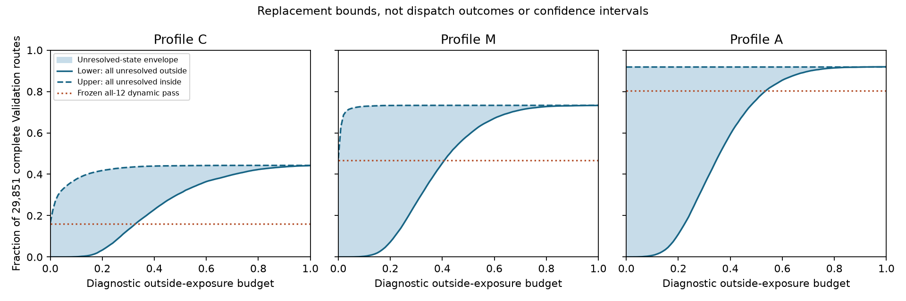

# 交通状态替代：Validation 离线对照结果

## Material Passport

- Origin Skill: academic-research-suite / experiment-agent
- Origin Mode: authorized descriptive analysis
- Origin Date: 2026-09-27
- Verification Status: ANALYZED; engineering assertions passed
- Version Label: traffic_state_offline_comparison_v1

## 结论与完成边界

本批完成替代定义、离线预算曲线和逐路线变化定位。没有选择生产预算/未知政策，
没有替换冻结 profile、训练模型、读取 Test31 或运行派单。

主要发现不是“新方案更宽松/更严格”，而是：**UNKNOWN/MIXED 的处理决定了很宽的结果范围。**
因此目前的状态解释层不能无条件升级成硬门控；也不能把已知暴露很少解释为整条路线证据充分。

执行前协议 commit：`e13af72`。三日样本 9,954 / 9,946 / 9,951，共 29,851 条。
比较只限动态部分，原静态/方向/速度域不在本次判定中；也没有复现 Stage4 Gamma 政策或联合可派单资格。

## 1. 零预算端点：上下界不能被压成一个通过率

以下“确定在界内”要求把未分类暴露全算为环境外仍不超预算；“可能在界内”则把它全算为环境内。
均同时保留原 speed_cv/acceleration_rms 六项约束，不再叠加原 crawl/stop 六项。

| Profile | 原 12 项动态通过 | 零预算确定在界内 | 零预算可能在界内 | 其中未决 | 保留 variability 超限 |
|---|---:|---:|---:|---:|---:|
| C | 4,761 | 0 | 4,960 | 4,960 | 16,635 |
| M | 13,973 | 2 | 14,235 | 14,233 | 7,973 |
| A | 23,978 | 6 | 27,457 | 27,451 | 2,394 |

这些上下界是对未分类暴露的政策敏感性包络，不是置信区间，也不是 AV 安全性或服务率。
A 的已知环境外暴露为 0 是定义造成的；UNKNOWN/MIXED 仍无法确认属于已建模类别，不能自动放行。

## 2. 原来通过的路线为什么发生变化

在零预算诊断端点：

- C 原通过 4,761 条，其中 2,325 条出现已知环境外暴露，2,436 条落入未决，0 条确定在界内。
- M 原通过 13,973 条，其中 4,540 条出现已知 severe 暴露，9,431 条未决，2 条确定在界内。
- A 原通过 23,978 条，其中 23,972 条未决，6 条确定在界内，没有已知类别导致的超限。

反向看，原动态不通过、但新表达“可能在界内”的 C/M/A 路线分别有 2,524 / 4,802 / 3,479 条；
它们在零预算下全部未决，没有一条可以据此声称已被新方法救回。
已知暴露超限的变化也不代表基线错误：原 E/Q/C 容许有限暴露，而零预算要求近乎没有环境外暴露，
两者并非等强度政策。此处 1e-6 容差仅处理源 float32 舍入，不是科学暴露预算。

## 3. 预算曲线：只展示，不选阈值

下表是预先固定的 101 点曲线中的几个展示刻度，不是推荐配置：

| 环境外预算 | C 确定—可能在界内 | M 确定—可能在界内 | A 确定—可能在界内 |
|---|---:|---:|---:|
| 0% | 0—4,960 | 2—14,235 | 6—27,457 |
| 5% | 1—9,847 | 8—21,435 | 25—27,457 |
| 10% | 34—11,230 | 100—21,738 | 223—27,457 |
| 20% | 1,001—12,480 | 2,170—21,859 | 3,292—27,457 |
| 50% | 9,209—13,170 | 17,590—21,878 | 22,690—27,457 |
| 100% | 13,216—13,216 | 21,878—21,878 | 27,457—27,457 |

100% 端点是数学检查：交通暴露不再有区分作用，剩下 variability 家族的通过数。
不得为了接近原通过率而选择某个预算，这会把 Validation 变成参数拟合。

## 4. 时长与语义：本批能说明什么

按原 crawl/stop 家族是否超限分组，三天分布方向一致：C 家族未超限组的未分类占比中位数约
24.05%–24.17%，超限组约 38.86%–39.17%；对应的已知环境外暴露中位数前者为
0%–0.0794%，后者约 0.82%–0.91%。说明原表达和状态定义并不一一对应，不能仅从通过数认定等价。

C 家族超限组的最长合并拥堵段中位数约 3.89–4.29 秒。这是逐 traversal 的冻结预测时间权重，
不是 GPS 直接测得的连续交通事件；不能据此断言都是红灯、接客或无意义尖峰。
M 的 severe-only 最长连续时长尚未在现有产品中独立导出，本批不拿合并时长代替它。

短暂停车是否被误判为持续拥堵，仍需时间/空间上下文或独立观测证据；本批没有完成这个语义验证。
`case_locator.json` 按稳定哈希提供少量变化案例定位，不是人工裁决，也不代表类别准确率。

## 5. QA、资源与统计边界

- 29,851 条对账；原 C/M/A rho 和家族布尔标记逐行复算完全一致。
- 每日 101 个预算点，动态上下界 C→M→A 嵌套与预算单调均通过。
- 所有交叉计数精确回到每日路线总数；来源附加表与本轮重建表完全一致。
- 输入/profile/M3/config SHA 前后不变。13 项相关测试、compileall、diff check 通过。
- 分析运行约 2.70 秒，0.2 秒抽样 RSS 峰值 130.5 MiB；不含后续画图开销。无 GPU。
- 这是共享预测输入的规则比较，不是独立准确性验证，不证明派单收益。

按技能统计解释要求检查 11 类问题：Simpson（逐日并列、不从合并数推普遍关系）；
ecological（路线级计数不推断 link 安全）；Berkson（complete-route 选择偏差保留）；
collider（无因果控制分析，但已条件于完整性）；base-rate（给全体分母与基线）；
regression-to-mean（非前后干预）；survivorship（29,851 而非全部 30,000，不外推缺失路线）；
look-elsewhere（全部 101 点公开、无显著性筛选）；forking-paths（运行前固定协议、不选预算）；
causality（没有服务/安全效果声明）；reverse-causality（同源规则比较不提出因果方向）。
覆盖 11/11；没有 p 值或置信区间，不能以这些检查宣称样本没有偏差。

## 下一停止点

本批完成后停在“描述性替代对照已完成、生产政策未选”。
若继续，优先澄清 UNKNOWN/MIXED 的来源和代表性案例语义，再由用户决定是否定义小范围替代策略。
不应直接按零预算部署，也不应为了改善通过率把未知设为畅通。
预算、未知政策、连续时长政策均需在动态实验前另行明确；41 个冻结场景保持不变。

## 文件

- `protocol.md`：执行前定义；`summary.json`：来源、资源、端点计数。
- `budget_curves.json`：每日与合并全部预算交叉表。
- `distributions.json`：每日家族分组分位数；`case_locator.json`：变化案例。
- 逐路线表：`stage3/output/traffic_state_offline_comparison/date=YYYYMMDD.parquet`（本地生成、不入 Git）。
- 重画图：`python -m stage3.scripts.traffic_state_offline_comparison --plot-only`。
