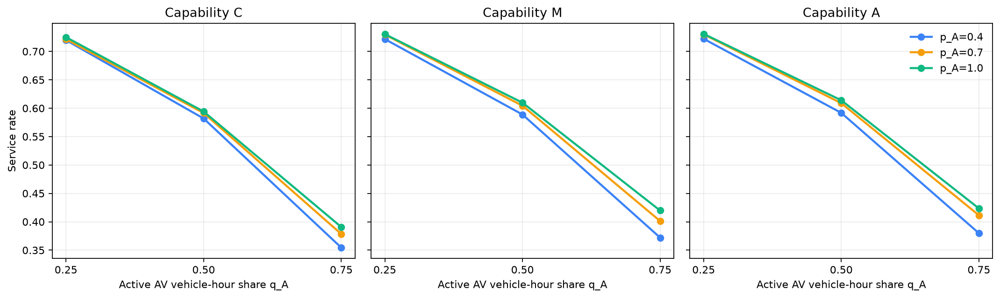
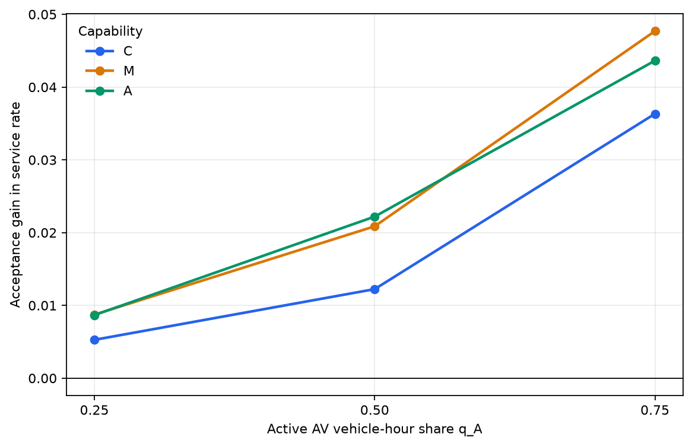
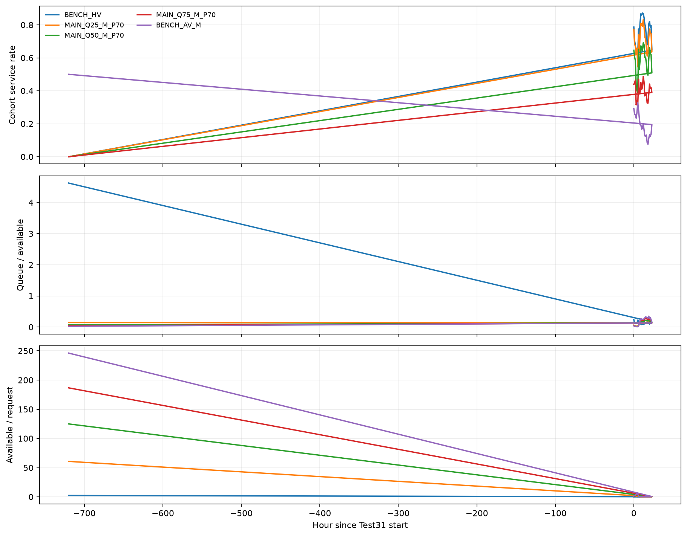
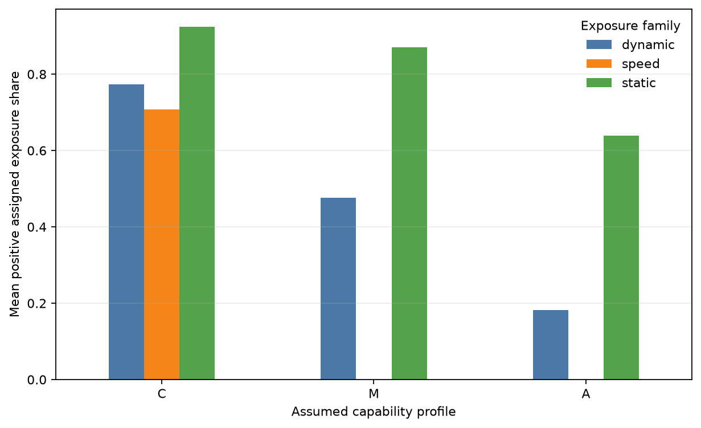
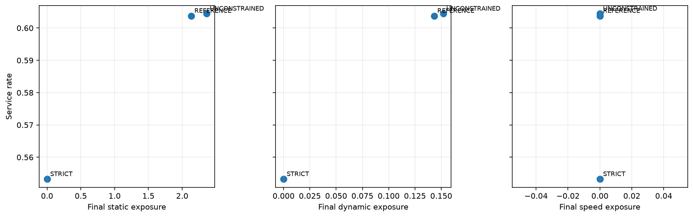

# ODD-Aware Dynamic Dispatch for Mixed Human-Driven and Autonomous Ride-Hailing Fleets: Passenger Acceptance and Operational-Envelope Budgets

## Abstract

Ride-hailing platforms may operate human-driven vehicles (HVs) and autonomous vehicles (AVs) simultaneously, yet nominal vehicle-hours are not necessarily interchangeable when AV assignment depends on passenger acceptance, route-specific operational suitability, and evolving fleet states. We develop an ODD-aware rolling dispatch framework that combines an empirically reconstructed HV service fleet with full-horizon AV supply. AV candidate assignments require realized passenger acceptance and hard route feasibility, while separate static, dynamic, and speed suitability measures enter family-specific cumulative operational-envelope budgets. A sparse candidate graph and sequential lexicographic mixed-integer assignment prioritize critical orders, total service, carry-over recovery, pickup time, and optional normalized operating cost. Using 30,000 requests from a full-day Xi'an evaluation, we examine AV active vehicle-hour penetration, assumed capability, and scenario-level acceptance. Increasing AV penetration from 0.25 to 0.75 reduced marginal mean service rate from 0.7258 to 0.3924. For the intermediate capability profile, the service gain from full versus 0.40 acceptance increased from 0.0087 to 0.0477 across the same penetration range. A finite reference-envelope policy reduced static and dynamic exposure by 9.6% and 5.6%, respectively, while losing approximately 0.1% service relative to unconstrained dispatch. The findings indicate that mixed-fleet transition should be evaluated through effective service capacity and coordinated across penetration, acceptance, capability, and transparent ODD-aware dispatch controls.

**Keywords:** autonomous ride-hailing; mixed-fleet dispatch; operational design domain; passenger acceptance; rolling assignment; effective service capacity; lexicographic optimization

## 1. Introduction

Ride-hailing platforms may experience a transition period in which human-driven vehicles (HVs) and autonomous vehicles (AVs) serve the same demand [CITE-L3: mixed HV/AV fleets]. This transition creates an operational problem that is more complex than substituting one vehicle count for another. Orders arrive continuously, vehicles become available at different times and places, passengers have finite pickup patience, and each dispatch changes the future fleet state. Dynamic assignment is therefore central to platform performance [CITE-L1: dynamic ride-hailing assignment].

The mixed-fleet setting introduces additional asymmetries. An HV may serve an order whenever its reconstructed working session, pickup feasibility, and predicted service completion permit. An AV assignment additionally depends on the passenger's realized willingness to accept AV service, the hard readiness of the requested route, and the route's utilization of capability-dependent operational envelopes. Consequently, a nominal AV hour need not be interchangeable with an empirically observed HV service hour. The distinction is between nominal supply and *effective service capacity*: the portion of supply that can be transformed into feasible assignments at the required location and time.

Existing research provides strong foundations in dynamic ride-hailing assignment, fleet control, mixed-fleet operations, passenger acceptance, and automated-driving operational design domains. These streams, however, are rarely integrated in one rolling assignment model that simultaneously represents empirical HV availability, full-horizon AV supply, finite passenger patience, realized AV acceptance, route-specific hard feasibility, continuous multi-dimensional operational suitability, and cumulative operational-envelope controls. The gap is therefore not the absence of dispatch or AV studies, but the limited integration of these elements into an empirically grounded mixed-fleet operations experiment.

This study addresses the following central question: **How should a ride-hailing platform dynamically dispatch a mixed fleet of HVs and AVs when AV serviceability depends jointly on passenger acceptance, assumed AV capability, route-specific operational suitability, and the evolving fleet state?** We develop an event-driven rolling framework in which candidate assignments are spatially filtered and routed, incompatible AV arcs are removed, and the remaining sparse assignment problem is solved lexicographically. Operational suitability is represented through a hard route state and separate static, dynamic, and speed ratios. Positive reference-envelope exceedance enters family-specific cumulative budgets instead of one weighted overall risk score.

Three research questions organize the empirical analysis:

- **RQ1:** How does AV active vehicle-hour penetration affect effective service capacity?
- **RQ2:** How do passenger AV acceptance and assumed AV capability moderate the effect of fleet transition?
- **RQ3:** Can family-specific cumulative operational-envelope budgets control AV exposure while preserving service performance?

The study makes four contributions. First, it formulates a rolling mixed-fleet dispatch problem combining reconstructed empirical HV sessions, full-horizon AVs, passenger patience and carry-over, realized acceptance, and route eligibility. Second, it introduces a multi-dimensional AV route interface that separates hard feasibility from continuous static, dynamic, and speed suitability without imposing arbitrary cross-family weights. Third, it embeds family-specific cumulative exposure budgets as transparent dispatch controls. Fourth, it provides deterministic empirical scenario evidence on interactions among AV penetration, passenger acceptance, assumed capability, and operational-envelope policy. A normalized operating-cost sensitivity is retained as a secondary analysis rather than a separate headline contribution.

The remainder of the paper reviews the relevant literature, defines the mixed-fleet problem, presents the route interface and rolling optimization model, describes the full-day experiment, reports the findings, and discusses managerial implications and limitations.

## 2. Literature review

### 2.1 Dynamic ride-hailing dispatch

Dynamic ride-hailing control repeatedly matches newly arriving and waiting orders with spatially distributed vehicles. The decision process must balance immediate assignment opportunities against future vehicle states, travel times, and service loss. Prior research has examined rolling matching, batching, repositioning, queueing, and large-scale assignment [CITE-L1: dynamic ride-hailing assignment]. Finite passenger patience adds a deadline structure: an order not selected in one epoch may remain available, but only until its pickup deadline. Studies of abandonment and rolling carry-over motivate representing unserved orders explicitly rather than treating every unmatched epoch as final rejection [CITE-L2: patience and carry-over].

Our model belongs to this dynamic assignment stream but focuses on a heterogeneous eligibility structure. It uses sparse feasible arcs and preserves orders across 30-second epochs until they are matched or patience-expired. Critical orders and previously carried orders receive explicit lexicographic priority rather than ad hoc scalar weights.

### 2.2 Mixed HV/AV fleet operations

Mixed fleets combine vehicle types with different availability, operating assumptions, and service restrictions. The literature has begun to examine transitions from conventional to automated mobility and the operational consequences of heterogeneous fleets [CITE-L3: mixed HV/AV fleets]. A recurring challenge is defining a comparable fleet scale. Physical vehicle counts may be misleading when one fleet follows observed work sessions while another remains available across the horizon.

We use active vehicle-hours as the penetration basis. HV availability is reconstructed from observed service sessions, whereas idle AVs are available across the full experiment horizon. The experiment substitutes AV hours for target HV hours relative to a frozen exact baseline. This design makes the accounting explicit while retaining the operational asymmetry that motivates the study.

### 2.3 Passenger acceptance of autonomous mobility

Passenger willingness to use autonomous mobility is heterogeneous and context-dependent [CITE-L4: passenger AV acceptance]. Acceptance affects operations because an otherwise feasible AV cannot serve an order whose passenger does not accept AV service. Nevertheless, an operational scenario parameter should not be confused with an estimated behavioral model.

We distinguish the scenario probability `p_A` from the realized order-level indicator `a_o^A`. A frozen common-random-number draw assigns each order its realized eligibility for every acceptance scenario. This construction supports controlled operational comparisons but does not estimate individual preferences, willingness to pay, or policy-induced changes in acceptance.

### 2.4 ODD- and capability-constrained AV operation

An automated-driving operational design domain (ODD) describes conditions under which the system is intended to operate [CITE-L5: ODD standard]. Route compatibility may depend on network structure, intersections, traffic conditions, and speed-domain characteristics [CITE-L6: route-level ODD suitability]. A binary route label alone can be too coarse for dispatch: two feasible routes may place very different demands on the same assumed capability profile.

Our interface therefore separates hard route state from continuous operational suitability. Hard feasibility determines whether an AV arc may enter the candidate graph. Three continuous ratios describe static, dynamic, and speed utilization relative to a profile-specific reference envelope. Their positive exceedances remain separate throughout the optimization. They are operational quantities, not accident, failure, or safety probabilities.

### 2.5 Research gap and positioning

The literature streams above are individually mature but their integration remains underexplored. Dynamic matching models often assume homogeneous serviceability; mixed-fleet studies may abstract from order-level passenger acceptance; and ODD discussions may not connect route-level suitability to rolling platform assignment. Moreover, a weighted compatibility score can obscure which capability family constrains operation.

We position the study at this intersection. Sequential lexicographic optimization preserves the priority of service objectives that are not naturally commensurate [CITE-L7: lexicographic optimization], while family-specific cumulative constraints provide explicit operational controls [CITE-L8: cumulative operational budgets]. Sparse candidate construction makes the repeated mixed-integer assignment computationally tractable without forming a dense order-by-vehicle matrix [CITE-L9: sparse rolling assignment].

## 3. Problem description

Consider a platform operating over a sequence of decision epochs `t`. Orders `o` arrive dynamically at request times `r_o`. Vehicles `v` are either HVs or AVs. An HV is available only during its reconstructed service session and can accept an assignment only if the predicted pickup and service fit within that session. An idle AV is available throughout the experiment horizon, subject to route and passenger eligibility.

Each order has maximum pickup wait `W_max` and deadline

$$
D_o = r_o + W^{max}.
$$

At epoch `t`, its elapsed waiting time is `w_o(t)`. A candidate arc from vehicle `v` to order `o` is pickup-feasible only if

$$
w_o(t) + \hat p_{vo,t} \leq W^{max},
$$

where `p_hat_vo_t` is the routed pickup-time estimate. An order not selected remains in the queue and enters subsequent decision epochs until assignment or deadline. The term *patience-expired* denotes this modeled deadline outcome; it is not interpreted as observed behavioral cancellation.

AV assignment requires two additional conditions. First, the realized acceptance indicator for the order must equal one. Second, the original requested route must be ready for the assumed AV profile: its hard state must be FEASIBLE and the required route evidence must be complete. Feasible AV routes additionally carry static, dynamic, and speed suitability ratios. These ratios may be left unconstrained or controlled through cumulative family budgets.

The platform must decide which sparse feasible vehicle-order arcs to activate at every epoch. It seeks to rescue orders closest to expiration, maximize total assignments, recover carried orders, minimize pickup time, and—when enabled—reduce normalized operating-time cost without violating a bounded local pickup-objective relaxation. Every selected assignment changes later vehicle positions and availability, coupling decisions across the day.

### Notation summary

| Symbol | Meaning |
|---|---|
| `o`, `v`, `t` | order, vehicle, and decision epoch |
| `q_A` | requested AV active vehicle-hour share |
| `p_A` | scenario-level AV acceptance probability |
| `a_o^A` | realized binary AV acceptance indicator |
| `H_ok` | hard AV route state under capability profile `k` |
| `rho_ok^f` | route suitability ratio for family `f` |
| `e_ok^f` | positive reference-envelope exceedance |
| `x^H_vo,t`, `x^A_vo,t` | HV and AV assignment decisions |
| `Gamma_f` | family-specific cumulative mean-exposure allowance |
| `p_hat_vo,t` | routed pickup ETA |
| `eta_c` | normalized AV-to-HV cost ratio |
| `epsilon_W` | local pickup-objective relaxation |

The complete notation list is supplied with the manuscript artifacts.

## 4. Methodology

### 4.1 Empirical route-suitability interface

The dispatch model consumes a compact route-level interface rather than the full upstream map-matching and prediction workflow. For each order and assumed capability profile, the interface supplies the original route, a hard state `H_ok ∈ {FEASIBLE, INFEASIBLE, UNKNOWN}`, evidence completeness, decision-time service predictions, and three continuous suitability ratios. Only FEASIBLE routes with complete evidence can generate AV assignment arcs. INFEASIBLE and UNKNOWN routes remain eligible for HV service but are excluded from AV candidates.

For each family `f ∈ {static, dynamic, speed}`, the suitability ratio `rho_ok^f` compares the order route's descriptor with the corresponding capability envelope. The positive exposure is

$$
e_{ok}^{f} = [\rho_{ok}^{f}-1]_+ = \max(\rho_{ok}^{f}-1,0).
$$

An exposure of zero means that the ratio does not exceed the frozen reference envelope. A positive value measures the amount of reference-envelope exceedance. No weighted average is formed across families. The static family captures route and intersection structure; the dynamic family is derived from decision-time traffic predictions; and the speed family captures route speed-domain utilization. These values describe operational compatibility and do not quantify physical safety.

### 4.2 Mixed HV/AV fleet reconstruction

HV supply is an empirically reconstructed effective service fleet derived from observed service sessions on 31 October 2016. The sum of exact continuous session durations is

$$
H^{base}_{exact}=12279.336389\ \text{vehicle-hours}.
$$

This exact continuous quantity—not a 15-minute binned supply-profile equivalent—is the penetration denominator. A full-horizon AV contributes 24 active vehicle-hours. For requested penetration `q_A`, the number of AVs is obtained by rounding the implied full-horizon count, and the achieved penetration is

$$
\hat q_A = \frac{24N_{AV}}{H^{base}_{exact}}.
$$

The target residual HV hours equal `H_base_exact - 24 N_AV`, truncated at zero. Whole empirical sessions are selected in a stable order to approximate that target. The resulting achieved shares were 0.250176, 0.500353, and 0.750529 for requested shares 0.25, 0.50, and 0.75. This approach defines active-hour substitution without treating the number of reconstructed HV sessions as a physical fleet census.

Idle AVs are assumed available across the full experiment horizon. Charging, state of charge, maintenance, depot operations, and duty scheduling are not modeled. These assumptions are consequential and are revisited in Section 9.

### 4.3 Passenger AV acceptance

For a scenario-level acceptance probability `p_A ∈ [0,1]`, each order receives a frozen uniform variate `u_o` and realized indicator

$$
a_o^A = \mathbf{1}(u_o \leq p_A).
$$

An AV arc is permitted only if `a_o^A=1`. The same seeded order-level variates are reused across scenarios so that raising `p_A` changes eligibility consistently rather than introducing an unrelated realization. The distinction is essential: `p_A` is probabilistic and scenario-level, whereas `a_o^A` alone is binary and order-specific.

### 4.4 Sparse rolling assignment model

At epoch `t`, spatial filtering and pickup routing produce the sparse feasible-arc set `A_t`. For each feasible HV arc, `x^H_vo,t` equals one if HV `v` is assigned to order `o`; `x^A_vo,t` is defined analogously for AV arcs. The base assignment constraints are

$$
\sum_{v:(v,o)\in \mathcal A_t}(x^H_{vo,t}+x^A_{vo,t}) \leq 1 \qquad \forall o,
$$

and

$$
\sum_{o:(v,o)\in \mathcal A_t}(x^H_{vo,t}+x^A_{vo,t}) \leq 1 \qquad \forall v.
$$

The HV variable is defined only on HV arcs and the AV variable only on AV arcs; the nonapplicable vehicle-type variable is fixed to zero.

Vehicle availability, passenger patience, HV session completion, AV acceptance, hard route readiness, and evidence completeness are enforced during arc construction. This keeps invalid arcs out of the mixed-integer model rather than representing every possible order-vehicle pair with dense prohibitive constraints.

Orders unresolved in one epoch carry over. Search radius expands after failed rounds, while patience continues to decrease. An order is *critical* when its remaining patience is positive but no greater than one 30-second dispatch interval. Critical and carry-over status then enter the lexicographic objectives.

### 4.5 Family-specific cumulative operational-envelope budgets

Let `Z_t^f` be total exposure accumulated by AV assignments before epoch `t`, and let `N_t^A` be the corresponding assignment count. When family `f` has a finite allowance `Gamma_f`, the new assignments must satisfy

$$
Z_t^f + \sum_{(v,o)\in\mathcal A_t}e_{ok}^f x^A_{vo,t}
\leq
\Gamma_f\left(N_t^A+\sum_{(v,o)\in\mathcal A_t}x^A_{vo,t}\right).
$$

The constraint limits cumulative mean exposure to `Gamma_f`. It is applied independently to static, dynamic, and speed families. A null allowance disables the family constraint; zero permits only assignments with zero positive exposure in that family. `Gamma_f` is an operational reference budget, not a safety or legal threshold.

This cumulative form lets low-exposure assignments create room for later assignments while preserving a transparent day-to-date envelope. Because decisions are discrete, a finite budget may affect assignment choices even if the final trajectory retains positive numerical slack.

### 4.6 Lexicographic solution strategy and normalized cost

The sparse binary assignment is solved through exact sequential lexicographic levels:

1. maximize assignments of critical orders;
2. maximize total assignments;
3. maximize assignments of carry-over orders;
4. minimize total pickup ETA;
5. optionally minimize normalized operating-time cost.

After each level, its optimum is fixed as a constraint before solving the next. This preserves priority without arbitrary weights across service, urgency, recovery, and pickup objectives [CITE-L7: lexicographic optimization].

For cost-enabled scenarios, let `kappa_H` and `kappa_A` be normalized HV and AV operating-time coefficients and define

$$
\eta_c=\frac{\kappa_A}{\kappa_H}.
$$

Arc cost is proportional to routed pickup time plus predicted service time, multiplied by the applicable vehicle-type coefficient. If the level-four pickup optimum is `P_t*`, the cost level is restricted by

$$
\sum_{(v,o)\in\mathcal A_t}\hat p_{vo,t}(x^H_{vo,t}+x^A_{vo,t})
\leq (1+\epsilon_W)P_t^*.
$$

Thus, `epsilon_W=0.05` permits a 5% local epoch-level pickup-objective relaxation before cost minimization. It does not bound full-day pickup performance because the chosen assignments alter subsequent states.

The implementation is event-driven. A cKDTree first identifies nearby vehicles, retains at most 20 candidates per order, and expands the search radius from 2 km toward an 8 km cap after failed rounds. Pickup times are obtained through Valhalla matrix routing with caching and single-route fallback for failed cells. Feasible arcs are stored in compressed sparse-row form and solved with SciPy/HiGHS mixed-integer optimization. This design avoids dense order-by-vehicle matrices. It establishes a practical computational implementation but is not presented as evidence of production real-time deployment [CITE-L9: sparse rolling assignment].

## 5. Experimental design

### 5.1 Evaluation setting and outcomes

The final evaluation uses 30,000 ride-hailing requests from Xi'an on 31 October 2016 over a full-day horizon. Dispatch decisions occur every 30 s, and maximum pickup patience is 300 s. The primary capacity outcome is service rate, defined as the matched share of requests; patience expiration is its complementary capacity outcome in the complete runs. Pickup-time quantiles are conditional on matched passengers and are interpreted alongside service.

All scenario contrasts use frozen input data, route predictions, acceptance seed, fleet construction, and dispatch parameters. The analysis is deterministic: it reports finite differences, marginal means, and descriptive interactions without p-values, confidence intervals, or causal identification.

### 5.2 Main factorial and benchmarks

The main experiment is a 3 × 3 × 3 factorial with 27 scenarios:

- `q_A ∈ {0.25, 0.50, 0.75}`;
- capability profile `k ∈ {C, M, A}`;
- acceptance probability `p_A ∈ {0.40, 0.70, 1.00}`.

Four benchmarks are analyzed separately: an all-HV benchmark and all-AV C, M, and A composition extremes. The all-AV scenarios are not interpreted as technological performance upper bounds.

### 5.3 Operational-envelope policy design

The central policy scenario fixes `q_A=0.50`, Profile M, and `p_A=0.70`. Three policies are compared:

- **STRICT:** `Gamma = (0, 0, 0)`;
- **REFERENCE:** `Gamma = (2.145068, 0.149343, 0)` for static, dynamic, and speed;
- **UNCONSTRAINED:** all family allowances disabled.

REFERENCE was calibrated once from the `q_A=0.25`, Profile M, `p_A=1.00`, UNCONSTRAINED cumulative trajectory and then held fixed. It was not recalibrated on the central policy scenario.

### 5.4 Cost robustness and presentation plan

Cost robustness uses the central mixed-fleet case with unconstrained family budgets. Four normalized ratios `eta_c ∈ {0.50, 0.75, 1.00, 1.25}` are each paired with `epsilon_W=0` and `0.05`. Comparisons are made only within the same `eta_c`, because changing the ratio changes the normalized objective itself. Across the factorial, benchmark, policy, and cost blocks, 41 unique scenario executions were completed; each processed the same 30,000-request day.

The main text uses six compact tables and five figures. Detailed 27-scenario results, computational diagnostics, and cost graphics are assigned to the appendix.

## 6. Results

### 6.1 AV penetration and effective service capacity

Across the 27 main scenarios, marginal mean service rate decreased monotonically with AV penetration (Table 1; Figure 1). It fell from 0.7258 at `q_A=0.25`, to 0.5984 at 0.50, and to 0.3924 at 0.75. The 0.25-to-0.75 change was -0.3334, or -45.9% relative to the low-penetration level. Increasing AV active vehicle-hour share therefore did not translate into proportional effective service capacity in the modeled system.

**Table 1. Marginal service results by AV active vehicle-hour share**

| `q_A` | Marginal mean service rate | Change from prior level | Relative change from `q_A=.25` |
|---:|---:|---:|---:|
| 0.25 | 0.7258 | — | — |
| 0.50 | 0.5984 | -0.1274 | -17.6% |
| 0.75 | 0.3924 | -0.2060 | -45.9% |

Matched-passenger P95 pickup times remained within 289.3–293.0 s while main-scenario service rates spanned 0.3544–0.7309. Similar waiting quantiles among served passengers therefore did not imply similar platform performance when the patience-expired fraction differed substantially.

### 6.2 Passenger acceptance and capability moderation

Passenger acceptance became more operationally consequential as AV penetration rose. For Profile M, the service gain from raising `p_A` from 0.40 to 1.00 was 0.0087 at `q_A=0.25` and 0.0477 at `q_A=0.75`; the descriptive interaction contrast was 0.0390. The corresponding interaction contrasts for Profiles C and A were 0.0311 and 0.0350 (Table 2; Figure 2).

Capability improvement also mitigated assignment restrictions. At `q_A=0.75,p_A=0.70`, moving from C to A increased service by 0.0330. The gain was meaningful but did not offset the much larger service decline associated with aggressive active-hour substitution.

**Table 2. Selected acceptance and capability contrasts**

| Contrast | C | M | A |
|---|---:|---:|---:|
| Acceptance gain at `q_A=.25` | 0.0053 | 0.0087 | 0.0087 |
| Acceptance gain at `q_A=.75` | 0.0363 | 0.0477 | 0.0436 |
| Descriptive `q_A × p_A` contrast | 0.0311 | 0.0390 | 0.0350 |

For the C-to-A capability contrast at `p_A=0.70`, the service gain increased from 0.0085 at `q_A=0.25` to 0.0330 at 0.75. Capability therefore moderated, but did not eliminate, the fleet-composition effect.

### 6.3 Benchmark and temporal mechanism

The all-HV benchmark served 0.7889 of requests. Under Profile M and `p_A=0.70`, service was 0.7297, 0.6044, and 0.4013 at `q_A=0.25`, 0.50, and 0.75. The all-AV M composition extreme served 0.1515 (Table 3). Equalized active vehicle-hours thus did not yield equal effective service capacity once availability timing, passenger compatibility, and AV route eligibility were considered jointly.

The temporal anchors showed the same ordering during the defined morning and evening peak windows. Peak service decreased from 0.7705 in the all-HV benchmark to 0.1381 in the all-AV M composition extreme. Mean queue pressure rose from 0.1222 to 0.2566. Mean total available stock, however, generally increased toward the AV-heavy cases and reached 467.0 in the all-AV M scenario. The pattern supports an effective-service-capacity constraint rather than a simple shortage of logged total vehicles.

**Table 3. Benchmark and peak-window temporal anchors**

| Scenario | Full-day service | Peak service | Mean queue pressure | Mean total available stock |
|---|---:|---:|---:|---:|
| All-HV benchmark | 0.7889 | 0.7705 | 0.1222 | 378.5 |
| `q_A=.25`, M, `p_A=.70` | 0.7297 | 0.6959 | 0.1512 | 370.6 |
| `q_A=.50`, M, `p_A=.70` | 0.6044 | 0.5661 | 0.1921 | 377.6 |
| `q_A=.75`, M, `p_A=.70` | 0.4013 | 0.3743 | 0.2298 | 413.5 |
| All-AV M composition extreme | 0.1515 | 0.1381 | 0.2566 | 467.0 |

The log records only total available stock, not separate available-HV and available-AV trajectories. Passenger acceptance, AV route eligibility, and the different temporal supply constructions are plausible modeled channels, but their individual contributions cannot be causally decomposed from these outputs.

### 6.4 Capability-dependent operational-envelope dimensions

The relevance of static, dynamic, and speed families changed substantially across assumed capability profiles (Table 4; Figure 4). Profile C produced positive exposure on 0.9248, 0.7739, and 0.7073 of assigned routes for static, dynamic, and speed families. Under M, the corresponding values were 0.8698, 0.4764, and 0.0006; under A they were 0.6394, 0.1822, and 0.0000. Speed was therefore active for C, nearly inactive for M, and inactive for A.

**Table 4. Mean positive assigned-exposure share by capability profile**

| Profile | Static | Dynamic | Speed |
|---|---:|---:|---:|
| C | 0.9248 | 0.7739 | 0.7073 |
| M | 0.8698 | 0.4764 | 0.0006 |
| A | 0.6394 | 0.1822 | 0.0000 |

Within-profile variation across penetration and acceptance was smaller than the cross-profile change. The dominant reference-envelope dimension was therefore capability-dependent. This adaptive bottleneck would be obscured by a single weighted score.

### 6.5 Operational-envelope policy trade-off

STRICT, REFERENCE, and UNCONSTRAINED service rates were 0.5532, 0.6038, and 0.6044, with AV assignment shares of 0.0113, 0.1244, and 0.1217 (Table 5; Figure 5). Relative to UNCONSTRAINED, REFERENCE lost 0.0007 service, approximately 0.1%, while reducing final static exposure by 9.6% and dynamic exposure by 5.6%. STRICT lost 0.0512 service, or 8.5%, and lowered AV assignment share by 0.1104.

**Table 5. Operational-envelope policy comparison**

| Policy | Service rate | AV assignment share | Service loss vs. unconstrained | Static exposure reduction | Dynamic exposure reduction |
|---|---:|---:|---:|---:|---:|
| STRICT | 0.5532 | 0.0113 | 0.0512 (8.5%) | 100.0% | 100.0% |
| REFERENCE | 0.6038 | 0.1244 | 0.0007 (0.1%) | 9.6% | 5.6% |
| UNCONSTRAINED | 0.6044 | 0.1217 | 0.0000 | 0.0% | 0.0% |

STRICT represents a zero-exposure policy boundary, not safe or certified operation. REFERENCE provided a tested middle position that altered assignment composition and cumulative exposure while retaining almost all unconstrained service. Positive slack and zero binding-epoch counts do not imply that the discrete budget had no assignment effect.

### 6.6 Cost robustness

Within each fixed `eta_c`, permitting `epsilon_W=0.05` reduced normalized cost per matched order by 0.54%–1.60% (Table 6). Service changes ranged from -0.0051 to +0.0041, AV assignment-share changes ranged from -0.0174 to +0.0145, and P95 pickup changes ranged from -0.19 to +0.29 s.

**Table 6. Within-`eta_c` effect of `epsilon_W=.05` relative to zero**

| `eta_c` | Cost/matched change | Service change | P95 pickup change (s) | AV-share change |
|---:|---:|---:|---:|---:|
| 0.50 | -1.60% | +0.0000 | -0.19 | +0.0145 |
| 0.75 | -1.01% | +0.0041 | +0.29 | +0.0129 |
| 1.00 | -0.54% | -0.0014 | +0.12 | -0.0041 |
| 1.25 | -1.14% | -0.0051 | +0.00 | -0.0174 |

The direction of the assignment-composition response depended on `eta_c`. Raw normalized cost levels are not compared across ratios because each ratio defines a different objective. The local 5% pickup relaxation also does not imply a full-day 5% pickup guarantee.

## 7. Discussion

### 7.1 Fleet transition and effective capacity

The central empirical result is that higher nominal AV penetration did not preserve service under the frozen mixed-fleet design. The temporal evidence sharpens this interpretation: queue pressure increased even when more vehicles remained logged as available. Effective capacity is therefore a compatibility- and timing-conditioned quantity rather than a direct function of fleet hours.

The modeled channels are consistent with this result. A passenger-ineligible AV cannot serve the order; a route-ineligible AV does not enter the assignment graph; and full-horizon AV availability has a different time structure from reconstructed HV sessions. These channels jointly shape service, but the available logs do not identify causal percentages. The result should consequently be read as an operational systems finding for the evaluation design, not as evidence that AV technology is generally inferior.

### 7.2 Acceptance in AV-heavy fleets

Acceptance mattered more at high penetration because a larger portion of nominal supply was subject to order-level AV eligibility. At low penetration, the larger HV component could absorb more non-accepting orders. The positive acceptance-penetration interaction is thus operationally coherent, while remaining descriptive.

This finding connects passenger-facing and fleet-facing platform decisions. Increasing AV hours without coordinating acceptance can leave nominal capacity unavailable to particular orders. The analysis does not prescribe a specific acceptance intervention because `p_A` is exogenous and does not represent a calibrated Xi'an choice model.

### 7.3 Capability improvement and fleet composition

Broader assumed capability recovered assignment opportunities, particularly under high penetration, but did not restore parity with the all-HV benchmark. Capability expansion relaxes route-compatibility restrictions; it does not remove passenger ineligibility, temporal supply mismatch, or patience expiration.

The implication is not that capability improvement is ineffective. Rather, capability and fleet composition solve different parts of the operational problem. Platform planning should evaluate the productivity of AV hours under the intended profile and penetration instead of assuming that a broader envelope guarantees one-for-one HV replacement.

### 7.4 Adaptive operational-envelope bottlenecks

The family results demonstrate why ODD-aware dispatch should preserve multiple dimensions. Speed exposure was important under C but disappeared under A, while static and dynamic exposure remained active to different degrees. As one envelope expands, another can become the relevant bottleneck.

This pattern supports family-specific monitoring and control. It also cautions against interpreting any family as intrinsically dominant across technologies. C, M, and A are analytical reference profiles, and exposure measures operational utilization rather than physical danger.

### 7.5 Value and boundary of reference budgets

REFERENCE retained 99.9% of unconstrained service while reducing static and dynamic exposure. STRICT, in contrast, removed nearly all positive-exposure AV opportunities and incurred a larger service loss. A finite budget can therefore provide a transparent tested compromise between unconstrained exposure accumulation and a zero-exposure boundary.

The favorable central-case trade-off does not establish optimality or transferability. REFERENCE was calibrated once from a different frozen trajectory and then applied without adjustment. Its role is to demonstrate how an explicit cumulative control behaves, not to define a universal threshold.

### 7.6 Staged mixed-fleet deployment

Taken together, the results show a coupled rolling system. Passenger eligibility shapes the candidate set; capability shapes route compatibility; family budgets alter assignment choices; and local choices propagate into later vehicle states. Staged deployment should therefore be evaluated jointly across penetration, temporal supply placement, acceptance, capability, and ODD-aware policy.

This synthesis reflects four implemented elements: reconstructed empirical HV supply combined with full-horizon AVs; hard feasibility plus continuous family suitability; probabilistic scenario acceptance with order-level realization; and family-specific cumulative budgets. It does not assert novelty beyond this framework or a universal deployment policy.

## 8. Managerial implications

First, platforms should manage **effective service capacity rather than nominal AV share**. The 45.9% marginal service reduction between `q_A=0.25` and 0.75 shows that active-hour accounting alone does not guarantee service substitution. Fleet-transition dashboards should pair penetration with service, expiration, feasible-candidate, and peak queue measures.

Second, **passenger acceptance should be coordinated with fleet transition**. The Profile M acceptance gain increased from 0.0087 to 0.0477 as penetration rose. Passenger-facing service design and retention of flexible capacity therefore become more important when the platform depends more heavily on AV hours. This is a scenario-design implication, not an estimated response to marketing or pricing.

Third, **capability is mitigation rather than automatic replacement**. The C-to-A gain of 0.0330 at high penetration shows real operational value, but it did not offset the fleet-composition effect. Capability investments should be evaluated against service productivity at the intended demand and penetration.

Fourth, **operational-envelope monitoring should remain family-specific**. Speed activity moved from 0.7073 under C to zero under A, while static and dynamic dimensions remained active. Separate reporting makes bottleneck migration visible and avoids arbitrary cross-family weights.

Fifth, **explicit cumulative budgets can serve as transparent controls**. REFERENCE reduced two exposure families with approximately 0.1% service loss in the central scenario. Such budgets can be stress-tested and communicated as operational controls, provided they are not mislabeled as safety thresholds.

Finally, **cost sensitivity should be evaluated within a fixed cost definition**. The local relaxation reduced normalized cost in all four within-ratio pairs, but AV-share responses changed direction. A platform should therefore report service, pickup, and composition alongside cost rather than selecting a ratio from raw normalized objective levels.

## 9. Limitations and future research

The study has eight primary limitations. First, the empirical evaluation covers a single Xi'an day. Multi-day and multi-city experiments are needed to assess temporal and geographic transferability. Second, passenger acceptance is exogenous and scenario-based; future work could estimate heterogeneous or endogenous acceptance from verified behavioral data. Third, C, M, and A are analytical nested profiles rather than commercial certification classes. Empirical capability calibration would strengthen external interpretation.

Fourth, static, dynamic, and speed exposure represent reference-envelope utilization, not accident or failure probability. Fifth, the HV fleet is reconstructed from empirical service sessions and is not registered fleet size. Sixth, AVs are available whenever idle across the full horizon; charging, state of charge, maintenance, depot constraints, and duty scheduling are absent [CITE-L10: charging and operational extensions]. Seventh, dispatch does not feed back into endogenous network congestion or traffic simulation. Eighth, costs are normalized rather than calibrated monetary economics.

Additional boundaries concern measurement and inference. Pickup quantiles condition on matched passengers and must be read with service and expiration. Available stock is logged only in total, preventing a type-specific temporal inventory decomposition. The factorial results are deterministic scenario contrasts with one frozen acceptance realization, not replication-based statistical estimates. Future research can add multiple evaluation days, charging and energy states, congestion feedback, endogenous acceptance, empirical AV capability calibration, and independently replicated scenarios without changing the conceptual distinction between hard feasibility and family-specific suitability.

## 10. Conclusion

This study examined dynamic dispatch of mixed HV/AV ride-hailing fleets when AV serviceability depends jointly on passenger acceptance, route capability, operational suitability, and evolving fleet state. The proposed framework integrates reconstructed empirical HV sessions with full-horizon AV supply, finite patience and carry-over, a hard-plus-continuous route interface, family-specific cumulative exposure budgets, and sparse sequential lexicographic assignment.

The full-day Xi'an experiment produced four principal findings. Increasing AV active vehicle-hour penetration from 0.25 to 0.75 reduced marginal mean service from 0.7258 to 0.3924. Under Profile M, the service value of full versus 0.40 acceptance rose from 0.0087 at low penetration to 0.0477 at high penetration. Moving from C to A improved service by 0.0330 in the high-penetration central acceptance slice but did not close the fleet-composition gap. Finally, a finite REFERENCE policy lowered static and dynamic exposure by 9.6% and 5.6% while sacrificing approximately 0.1% service relative to unconstrained dispatch.

These findings indicate that nominal AV share is an incomplete deployment metric. Mixed-fleet performance depends on the interaction of fleet timing, passenger eligibility, capability, and dispatch policy. Transparent family budgets can help platforms examine this interaction without collapsing distinct operational dimensions into an arbitrary weighted score. Future work should test the framework across days and cities and incorporate endogenous passenger choice, charging and state of charge, traffic feedback, and empirically calibrated AV capability profiles.

## Appendix and supplementary material

The planned appendix documents capability-profile definitions, route-suitability construction, exact fleet reconstruction, sparse computation, complete factorial outcomes, policy trajectories, cost robustness, and reproducibility mappings. Essential assignment and cumulative-budget equations remain in the main text.
